# 포팅 매뉴얼

## 🌟 주요 기능

- 헬스인과 트레이너의 PT 관리 서비스
- 식단, 운동, PT 일정, 인바디 검사지 등 **PT에 필요한 정보 관리**
- AI를 이용한 동영상 자세 피드백
- webRTC를 통한 실시간 자세 피드백

## 💻 개발 환경

### Backend

| IDE | IntelliJ Ultimate 2024.1 |
| --- | --- |
| Language | java temurin 17.0.11 |
| Framework | Spring Boot 3.3.2, Spring Security, Spring JPA, Lombok |

### Frontend

| IDE | Visual Studio Code |
| --- | --- |
| Language | JavaScript(ES6+), TypeScript |
| Framework  | React, Vite |
| Library  | zustand4.5.4, firebase 10.12.5, date-fns3.6.0, qrcode.react  3.1.0 |
| Library - UI 컴포넌트 | react-icons 5.2.1, react-modal 3.16.1, 
react-datepicker 7.3.0, recharts 2.12.7, 
styled-components 6.1.12, tailwindcss 3.4.6 |
| Library - 라우팅 | react-router-dom 6.25.1 |
| Library -네트워킹 | axios 1.7.2, sockjs-client1.6.1, stompjs2.3.3, websocket 1.0.35 |
| bulid,Bundling | vite 5.4.0, vite-plugin-pwa 0.20.1 |

### Database

- MySQL 8.0.37
- Redis 7.4.0

### Web RTC

- openvidu 3.0.0

### AI

| IDE | PyCharm Professional 2024.1.4 |
| --- | --- |
| Language | Python 3.12.3 |
| Framework, Library | Flask 3.0.3, Werkzeug 3.0.3, Streamlit, OpenCV 4.10.0.84, Mediapipe 0.10.14, Numpy 2.0.1 |

### CI/CD

- AWS EC2
- Docker
- Caddy
- Jenkins

### 협업 툴

- GitLab
- Notion
- Mattermost
- Discord

### 기타 편의 툴

- postman
- ERD Cloud

## 🌏 배포 설정

### Git Lab과 Jenkins를 이용한 CI/CD 구축

- gitlab
    
    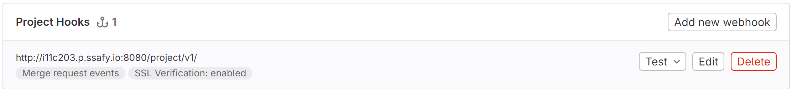
    
- jenkins
    - 접근 url : http://i11c203.p.ssafy.io:8080
    - 아이디: EggInHealth
    - 비빌번호: egginhealthssafy0722
- Backend & frontend
    - 젠킨스와  gitlab 레포지토리 연결
    
    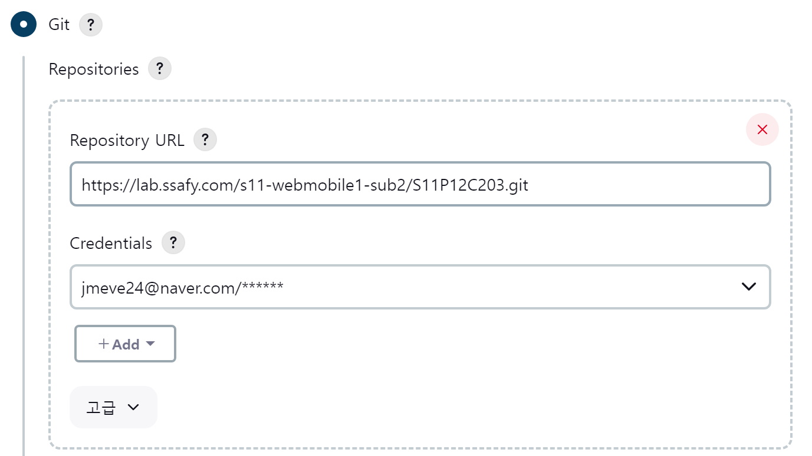
    
    - 빌드 이벤트를 등록
    
    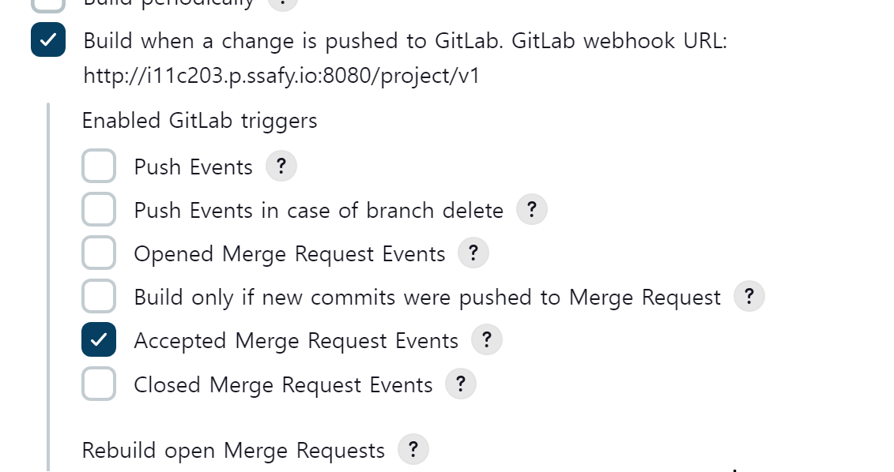
    
    - 빌드 설정
        
        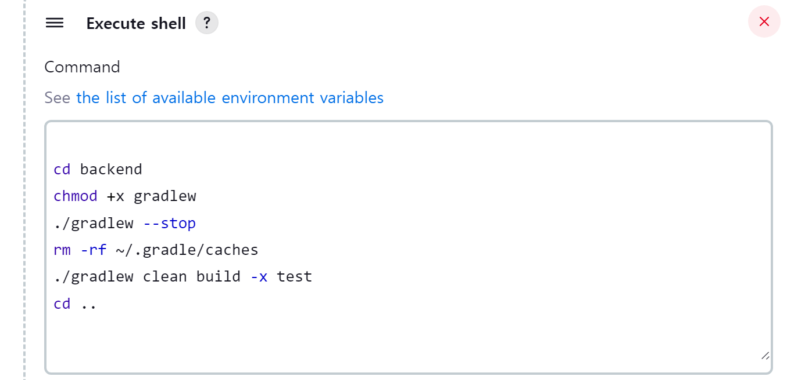
        
        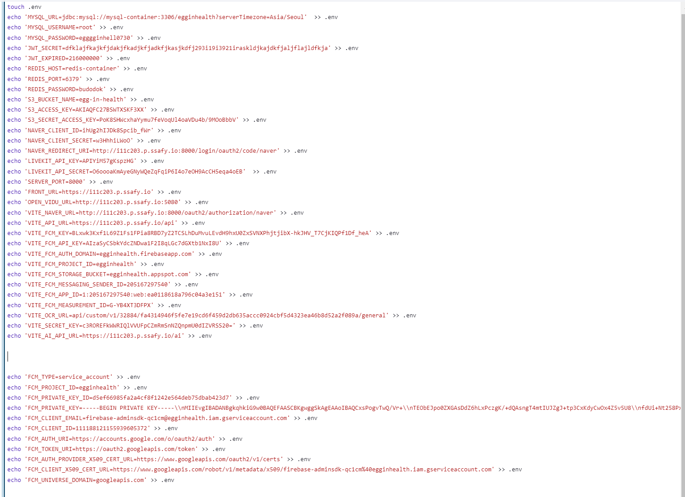
        
        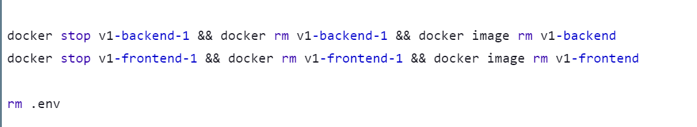
        
        - compose 환경변수 값 설정
        - 젠킨스 컨테이너 에서 빌드 후 docker-compose 파일 실행
        - 젠킨스 컨테이너에서 도커 데몬에 명령어를 전달해 젠킨스 컨테이너 밖에서 도커 컨테이너가 만들어지게함

- caddy 설정
    - caddy2 Lets’s Encrypt에서 SSL/TLS 자동 인증서 발급
    - 프록시 설정
        - 프론트엔드 경로:  /
        - 백엔드 경로 : /api
        - AI 경로: /ai
    
    
    
    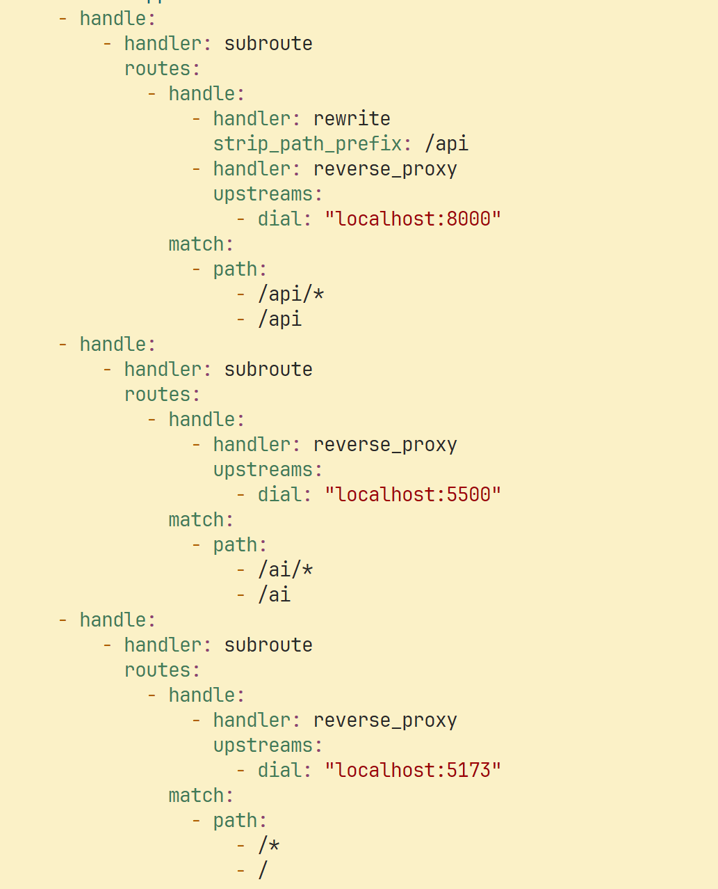
    

## ⚓ EC2 포트 정리

| PORT | 이름 |
| --- | --- |
| 80 | http-https 로 프론트 페이지로 리다이렉트  |
| 8081 | Jenkins Docker Container |
| 3306 | MySQL Docker Container |
| 5500 | AI Docker Container |
| 5173 | React Docker Container |
| 7880 | Caddy Docker Container |
| 8000 | SpringBoot Docker Container |
| 6379 | Redis Docker Container |
| 7000 | OpenVidu Redis Docker Container |
| 20000 | OpenVidu MongoDB Docker Container |
| 3000 | OpenVidu Grafana Docker Container |
| 9101 | OpenVidu Minio-Console Docker Container |
| 5000 | OpenVidu Dashboard Docker Container |
| 8080 | OpenVidu LiveKit Docker Container |
| 608 | OpenVidu  |

## 💡프로젝트 EC2 인프라 구조

.png)

- Backend
    - 젠킨스 에서 빌드 후 기존에 존재하던 백엔드 도커 컨테이너를 중단 후 삭제한다.
    - docker compose 명령문을 실행한다.
        
        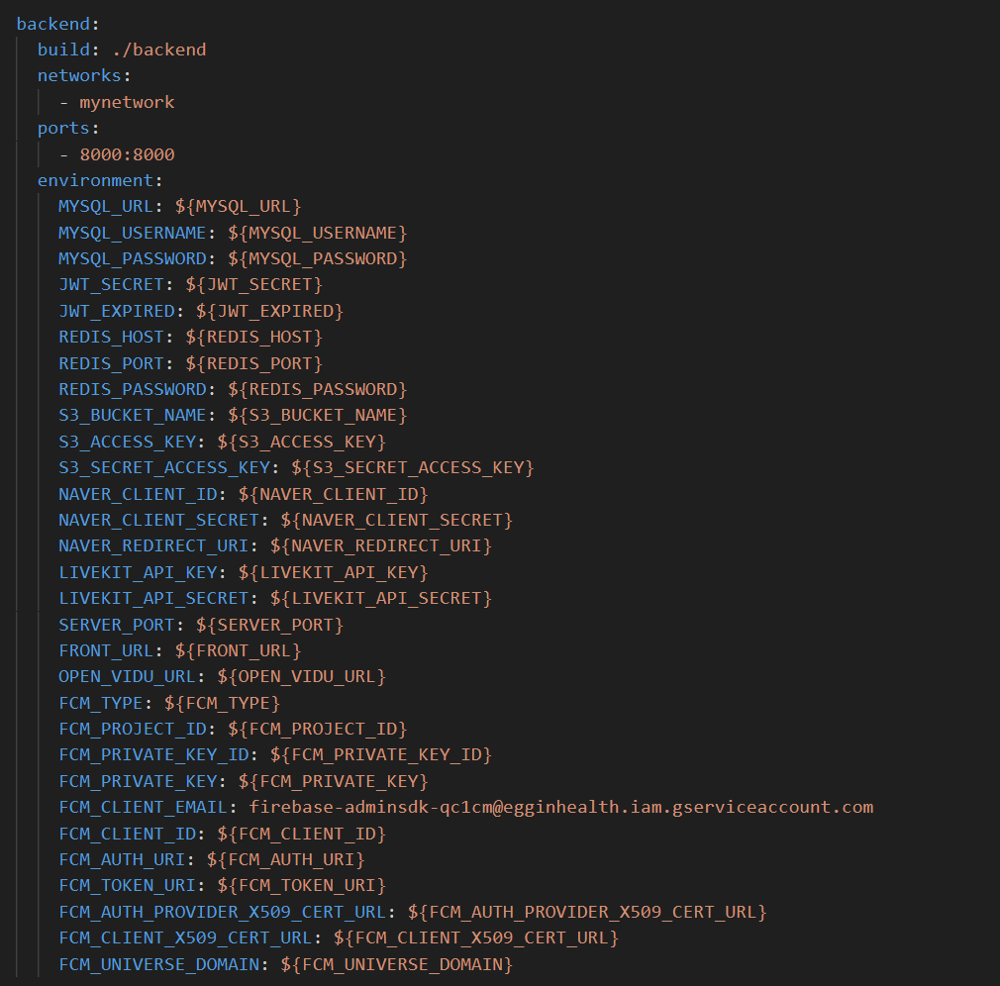
    - 백엔드 서버 도커 파일
        
        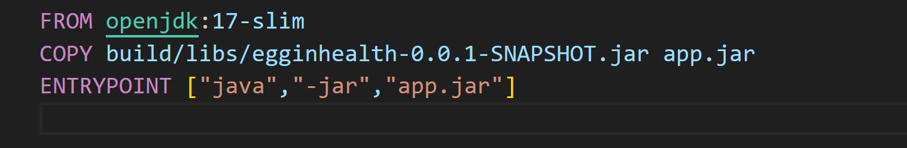
        
    - application.yml
        
        ```yaml
        spring:
          config:
            import: optional:file:.env[.properties]
        
          datasource:
            driver-class-name: com.mysql.cj.jdbc.Driver
            url: ${MYSQL_URL}
            username: ${MYSQL_USERNAME}
            password: ${MYSQL_PASSWORD}
          jpa:
            database: mysql
            database-platform: org.hibernate.dialect.MySQLDialect
            show-sql: true
            hibernate:
              ddl-auto: update
            properties:
              hibernate:
                format_sql: true
          data:
            redis:
              host: ${REDIS_HOST}
              port: ${REDIS_PORT}
              password: ${REDIS_PASSWORD}
          security:
            oauth2:
              client:
                registration:
                  naver:
                    client-name: naver
                    client-id: ${NAVER_CLIENT_ID}
                    client-secret: ${NAVER_CLIENT_SECRET}
                    redirect-uri: ${NAVER_REDIRECT_URI}
                    authorization-grant-type: authorization_code
                    scope: name, email, profile_image
                provider:
                  naver:
                    authorization-uri: https://nid.naver.com/oauth2.0/authorize
                    token-uri: https://nid.naver.com/oauth2.0/token
                    user-info-uri: https://openapi.naver.com/v1/nid/me
                    user-name-attribute: response
        
          cloud:
            aws:
              s3:
                bucket: ${S3_BUCKET_NAME}
                stack.auto: false
                region.static: ap-northeast-2
                credentials:
                  accessKey: ${S3_ACCESS_KEY}
                  secretKey: ${S3_SECRET_ACCESS_KEY}
        
          error:
            printStackTrace: true
        
          servlet:
            multipart:
              max-file-size: 10MB
        
        server:
          port: ${SERVER_PORT}
          forward-headers-strategy: framework
          tomcat:
            remoteip:
              host-header: X-Forwarded-Host
              port-header: X-Forwarded-Port
              protocol-header: X-Forwarded-Proto
              remote-ip-header: X-Forwarded-For
            use-relative-redirects: true
        
        # LiveKit configuration
        livekit:
          api:
            key: ${LIVEKIT_API_KEY}
            secret: ${LIVEKIT_API_SECRET}
        
        ```
        
- Frontend
    - 젠킨스 에서 빌드 후 기존에 존재하던 프론트 도커 컨테이너를 중단 후 삭제한다.
    - 프론트 파일 빌드 후  npm serve 패키지를 이용해 정적페이지를 반환한다.
    - 프론트 도커 파일
        
        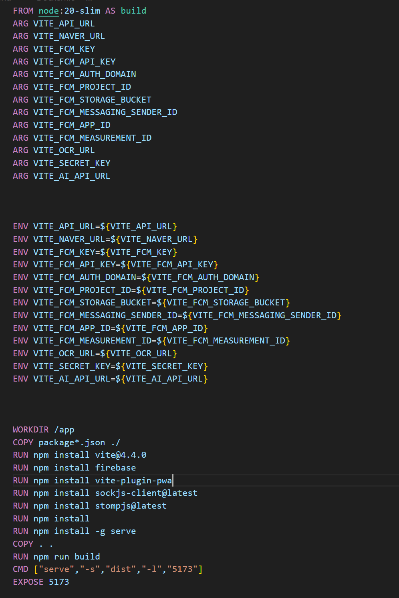
        
- AI
    - 도커 파일로 이미지 만든 후 컨테이너로 실행
    
    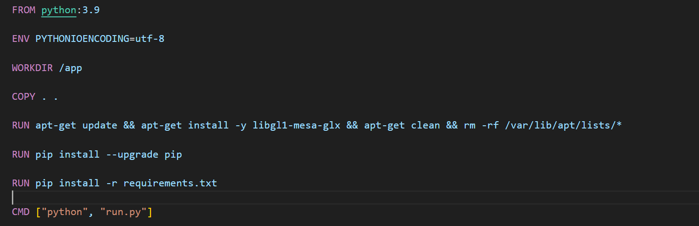
    
- OpenVidu server
    - 아래 명령어를 통해 Openvidu 관련된 파일 다운 후 실행함
    
    ```yaml
    sh <(curl -fsSL http://get.openvidu.io/community/singlenode/latest/install.sh)
    ```
    
- ReverseProxy
    - OpenVidu와 함께 사용하는 Caddy를 활용해 SSL 인증서를 적용하고 프론트,백,AI 리버스 프록시 추가 설정함

## 💾 DB 설정

### MySQL

- username : eggs
- password : egggginhell0730
- db erd
    
    .png)
    

### Redis

- password : budodok

## 📃 외부 서비스 문서

### 소셜 로그인

- 네이버
    - [https://developers.naver.com/products/login/api/api.md](https://developers.naver.com/products/login/api/api.md)

### OCR API

- 클로바
    - [https://guide.ncloud-docs.com/docs/clovaocr-overview](https://guide.ncloud-docs.com/docs/clovaocr-overview)

### FCM

- firebase
    - [https://firebase.google.com/docs/cloud-messaging/concept-options?hl=ko](https://firebase.google.com/docs/cloud-messaging/concept-options?hl=ko)